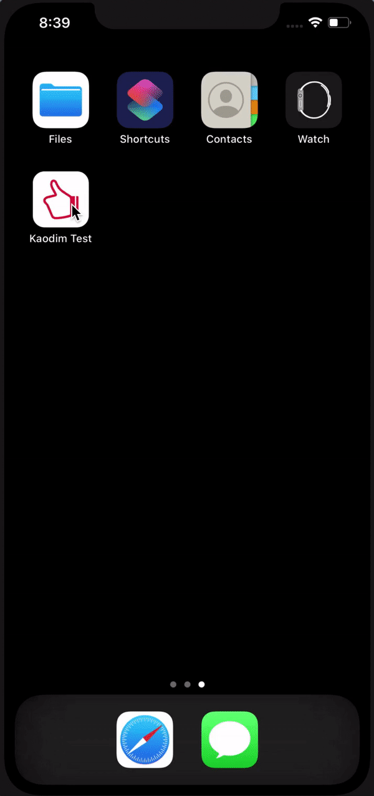

# KaodimSample
This sample iOS application lists the services available from Kaodim.

## Code Documentation

### Creating the Layout

#### MainActivity

The HomeViewController and EventsViewController hosts the layout necessary to have two tabs in one screen via a Tab Bar Controller. The layout components are referenced via IBOutlet to their respective UIViewController.


```swift

@IBOutlet weak var tableView: UITableView!
@IBOutlet weak var activityIndicatorView: UIActivityIndicatorView!
@IBOutlet weak var infoLabel: UILabel!
    
var viewModel: ServiceListViewModel!
```

#### ViewModel

Instantiates the ViewModel

```java
viewModel = ServiceListViewModel(endpoint: Endpoint.home, repository: ServiceTypeListRepository.shared)
 ```
 
 ### Making the API request
  
The ServiceTypeRepository protocol is extended by ServiceTypeListRepository. This repository is responsible for making the network request to the server in order to get the service type lists.
 
 ```swift
protocol ServiceTypeRepository {
    func fetchServices(from endpoint: Endpoint, successHandler: @escaping (_ response: [ServiceTypeGroup]) -> Void, errorHandler: @escaping(_ error: Error) -> Void)
    func handleError(errorHandler: @escaping(_ error: Error) -> Void, error: Error)
}
```

 ### Parsing the response
 
 The response from the repository is passed back to the ViewModel asynchronously, which is then attached to a subscriber of a reactive stream observable object for the response, loading, and error variables. This is done so that the ViewController can directly observe the changes that are occuring in the ViewModel and updates itself.

```swift
class ServiceListViewModel {
    private let _serviceTypeGroupList = BehaviorRelay<[ServiceTypeGroup]>(value: [])
    private let _isFetching = BehaviorRelay<Bool>(value: false)
    private let _error = BehaviorRelay<String?>(value: nil)

    private func fetchServices(endpoint: Endpoint) {
          self._serviceTypeGroupList.accept([])
          self._isFetching.accept(true)
          self._error.accept(nil)

          repository.fetchServices(from: endpoint, successHandler: {[weak self] (response) in
              self?._isFetching.accept(false)
              self?._serviceTypeGroupList.accept(response)

          }) { [weak self] (error) in
              self?._isFetching.accept(false)
              self?._error.accept(error.localizedDescription)
          }
      }
}

```
Different states and components in the ViewController can be managed through subscribing the respective variables that are exposed by the reactive stream in the ViewModel.

```swift

//        Memory management by disposing the Observable once it is observed
    viewModel.list.drive(onNext: {[unowned self] (_) in
        self.tableView.reloadData()
    }).disposed(by: disposeBag)

    viewModel.isFetching.drive(activityIndicatorView.rx.isAnimating)
        .disposed(by: disposeBag)

    viewModel.error.drive(onNext: {[unowned self] (error) in
        self.infoLabel.isHidden = !self.viewModel.hasError
        self.infoLabel.text = error
    }).disposed(by: disposeBag)
        
        setupTableView()

```

 ### Reflecting changes in the View

The UITableCell for the header and service types are created from the ViewController

```swift

    func tableView(_ tableView: UITableView, viewForHeaderInSection section: Int) -> UIView? {
      let view = tableView.dequeueReusableCell(withIdentifier: "ServiceTypeHeader") as! ServiceTypeHeader
      view.configure(label: viewModel.servicesGroupList[section].name)
      return view
    }

    func tableView(_ tableView: UITableView, cellForRowAt indexPath: IndexPath) -> UITableViewCell {
      let cell: ServiceTypeCell = tableView.dequeueReusableCell( withIdentifier: "ServiceTypeCell", for: indexPath) as! ServiceTypeCell
      cell.selectionStyle = .none
      cell.configure(serviceType: viewModel.servicesGroupList[indexPath.section].serviceTypes[indexPath.row])
      return cell
    }

```

```swift
    class ServiceTypeHeader: UITableViewCell {

      @IBOutlet weak var labelText: UILabel!

      func configure(label: String) {
        labelText.text = label
      }
    }
```

```swift

class ServiceTypeCell: UITableViewCell {
    
    @IBOutlet weak var labelName: UILabel!
    @IBOutlet weak var serviceImage: UIImageView!
    
    func configure(serviceType: ServiceType) {
        labelName.text = serviceType.name
        
        let image = UIImage(named: "placeholder")
        if let url = serviceType.imageThumbUrl?.lg {
            if let imageUrl = URL(string: url) {
                serviceImage.kf.setImage(with: imageUrl, placeholder: image)
            }
        }
    }
}

```

This whole flow shows the implementation of this application in using RxSwift along with MVVM architecture.

## Challenges Faced in Completing This Application

### Taking up RxSwift

Due to time constraint, it was quite a challenge that I gave myself to try implement reactive programming into this project. However, upon adequate research into RxSwift, I was able to implement it.

### Cocoapods in test package

It was quite a frustrating experience to try and debug my unit test failing to run. It was just because one of the pod (RxCocoa) could not be imported in the test package. I had to spend a lot of time into that than doing the unit test itself.

## Final Product



